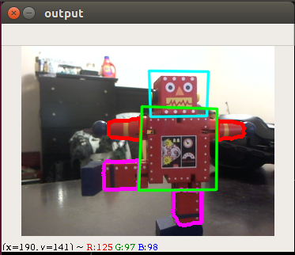
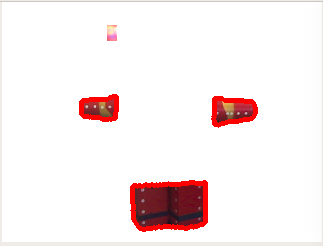
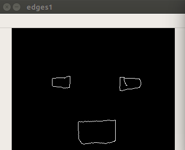
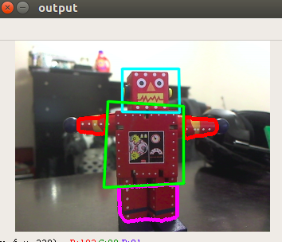

# ASadLittleRobot-CV

## Problem Constraints
1. Robot will always be facing the camera, ie body is parallel to the camera plane and he is upright
2. The robot will not be infront of a red background
2. The robot will not be occluded
2. We will not detect the rotation of the individual components about their axis
3. For legs we will detect the position as well as the rotation, restricted to 90 degrees
4. The head rotation will also be restricted to 90 degrees about its neck axis

## Approach Hypothesis
1. Segment out robot from background using hsv color thresholding
2. Create a model for individual components
3. Use individual components to do overall pose detection. 

## Model Ideas
1. Create a model using Sift for each body part
2. Extract features using sift for the entire image
3. Compare features using knn to classify object

# Results

## Step by step output

